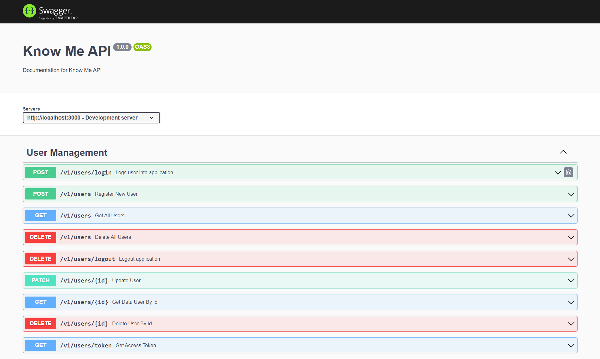

# Know Me

The application I created allows users to create and manage their professional portfolios. Users can add information about their skills, work experiences, completed projects, and certifications. The application provides an easy-to-use and intuitive platform for users to organize and showcase their portfolios effectively. With these features, users can demonstrate their abilities and achievements to potential clients or recruiters in an engaging and professional manner.

## Environment Variables

To run this project, you will need to add the following environment variables to your .env file

```
NODE_ENV=development

DB_HOST=<your host>
DB_PORT=<your port>
DB_USERNAME=<your username>
DB_PASSWORD=<your password>
DB_NAME=<your database name>

DB_HOST_TEST=<your host>
DB_PORT_TEST=<your port>
DB_USERNAME_TEST=<your username>
DB_PASSWORD_TEST=<your password>
DB_NAME_TEST=<your database name>

DB_HOST_PRODUCTION=<your host>
DB_PORT_PRODUCTION=<your port>
DB_USERNAME_PRODUCTION=<your username>
DB_PASSWORD_PRODUCTION=<your password>
DB_NAME_PRODUCTION=<your database name>

ACCESS_TOKEN_SECRET = knowme-secret-access-token-server
REFRESH_TOKEN_SECRET = knowme-secret-refresh-token-server

CORS_HOST = http://localhost:
CORS_PORT = 3001
```

## Run Locally

Clone the project

```bash
  git clone https://github.com/syahrulakbar/knowme-be
```

Go to the project directory

```bash
  cd knowme-be
```

Install dependencies

```bash
  npm install
```

Start the server

```bash
  npm run start
```

## Documentation

if the application can already run on the local server,
this application documentation can be accesed through:

```
http://localhost:3000/v1/docs
```

## Tech Stack

**Backend:** Node, Express, Mysql, Sequelize, JWT, Multer

## Features

- Login, Register, Logout with JWT
- Role Management
- CRUD User, Skills, Certificate, Projects, Experience
- Upload Image

## Screenshots



## Authors

- [@syahrulakbar](https://github.com/syahrulakbar)
